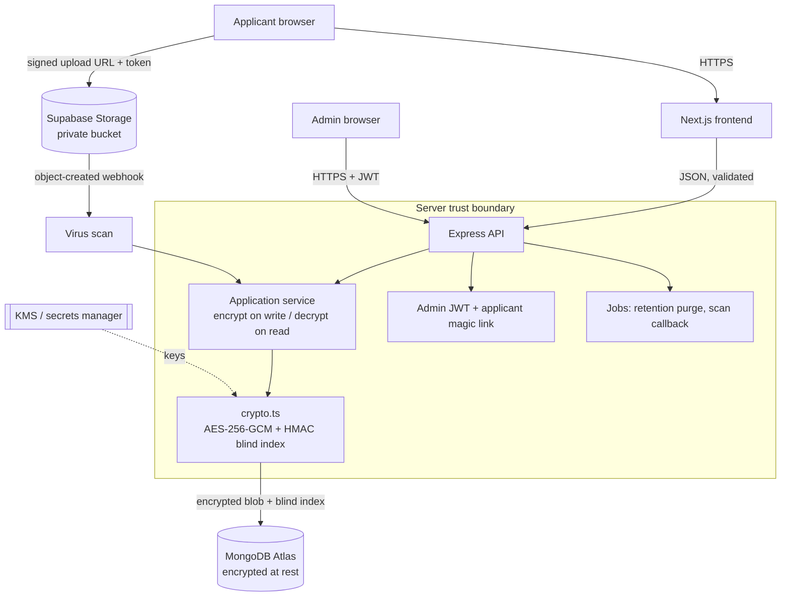

# Financial Information Collection Portal — Revised Architecture (v2)

This supersedes the original plan. The stack, module boundaries, and phased approach are
unchanged; the changes below address the gaps that are painful to retrofit once real PII is
flowing. **Decisions that were open have been made** (noted inline) so the build can start.

---

## Decisions made

| Question | Decision | Why |
| --- | --- | --- |
| Searchable-but-encrypted fields | **Blind index (HMAC) + AES-256-GCM**, two separate keys | Encrypted values can't be searched; the blind index enables duplicate-CNIC detection without storing plaintext |
| Applicant sessions | **Magic-link resume tokens**, no applicant accounts | Better public UX; avoids storing a second credential set |
| File storage | **Supabase Storage, private bucket, signed upload/download URLs** | Nothing sensitive touches the app disk or repo; browser uploads with a short-lived token |
| Database hosting | **MongoDB Atlas** (managed) | Encryption at rest, backups, network isolation without solo ops burden |
| Draft model | **One collection**; a draft is `status: 'draft'` | Removes the `drafts`/`applications` sync problem |
| Virus scanning | **Launch-critical, not "future"** | Public upload endpoint = must scan before accepting |

---

## The six fixes, in detail

### 1. Encryption at rest + the CNIC dedup problem
Sensitive fields (CNIC, IBAN, full name, DOB, exact income, document keys) are **AES-256-GCM
encrypted**. The entire 13-section form is stored as one encrypted blob (`encryptedData`).
Because encrypted values are randomized and can't be queried, each searchable/dedup field also
gets a **blind index**: `HMAC-SHA256(normalized_value, BLIND_INDEX_KEY)`, stored as a separate
field with a unique index. Duplicate detection and lookup run on the blind index; plaintext is
never queried and is decrypted only when an authorized admin opens a single record.
Two independent keys (`FIELD_ENCRYPTION_KEY`, `BLIND_INDEX_KEY`) — never reuse one for both.

> Implemented in `backend/src/utils/crypto.ts` and `backend/src/services/applicationService.ts`.

### 2. Managed services over self-hosted infra
MongoDB **Atlas** (not a self-hosted Mongo on a VPS) and **Supabase Storage** with a private
bucket and short-lived signed URLs for both upload and download (encrypted at rest). The app server
never stores files; the `uploads/` folder from the original plan is removed.

### 3. Applicant session model — magic link
No applicant accounts. On first save, a draft is created and a **single-use, expiring,
HMAC-signed** resume token is emailed as a link. Re-issuing a link rotates the stored nonce,
invalidating the old one. Draft IDs are never guessable resume handles.

> Implemented in `backend/src/services/resumeToken.ts`.

### 4. Consent, retention, deletion (the compliance layer)
- **Consent record**: which privacy-notice version was accepted, timestamp, IP — stored on the
  application (`consent` field).
- **Retention**: every record gets a `purgeAfter` date; a scheduled job in `jobs/` deletes
  expired drafts/rejected applications.
- **Subject access/erasure**: ability to export and permanently delete one person's complete
  data on request.
- Confirm the specifics of Pakistan's data-protection requirements with a qualified advisor —
  the architecture is built so these are configurable, not bolted on.

### 5. Single source of truth for drafts
One `applications` collection. `status: 'draft'` is a draft; submission flips status and assigns
the `APP-YYYYMMDD-NNNNNN` id. No separate `drafts` collection.

### 6. v1 scope (solo, ~5 weeks — be ruthless)
**In v1:** applicant multi-step form + autosave/resume, submission, file upload with scanning,
admin auth, application list/detail/search/filter, status management, full security +
encryption layer, audit logging, consent + retention.
**Deferred to v2:** reports & charts (Phase 18), applicant emails beyond "received",
Urdu/i18n, dark mode. None of these touch the core data model, so deferring costs nothing.

---

## Data model (corrected)

```
applications          # single source of truth (drafts + submitted)
  appId               # cleartext, assigned on submit
  status              # cleartext, indexed
  encryptedData       # AES-256-GCM blob of the whole form
  cnicIndex           # blind index, UNIQUE  -> duplicate detection
  ibanIndex           # blind index, indexed
  city                # cleartext (low sensitivity) -> dashboard filter
  employmentStatus    # cleartext -> filter
  incomeBand          # cleartext COARSE band -> filter (exact income is encrypted)
  consent             # { privacyNoticeVersion, acceptedAt, ip }
  submittedAt, purgeAfter, createdAt, updatedAt

admins                # admin users (bcrypt), roles: super_admin | reviewer | viewer
sessions              # refresh tokens
uploads               # file metadata + storage path + scan status (clean | pending | quarantined)
audit_logs            # every action: who, what, when, IP
settings              # form config, privacy-notice version
```

**Filtering principle:** the dashboard filters on cleartext metadata only. Opening one
application is what triggers decryption. Exact income lives encrypted; only the band is queryable.

---

## Architecture (with trust boundaries)



Keys never live in application code or the repo — they load from a secrets manager in
production and from `.env` only in local dev.

---

## API (corrected)

**Public / applicant**
```
GET   /api/form/config
POST  /api/application/save            # autosave draft (upsert by cnicIndex)
POST  /api/application/resume          # exchange magic-link token for a draft
POST  /api/application/submit
POST  /api/upload/presign              # returns a signed upload URL + token
POST  /api/captcha/verify
```

**Admin**
```
POST   /api/admin/login
POST   /api/admin/refresh
POST   /api/admin/logout
GET    /api/admin/applications         # filter/sort on cleartext metadata
GET    /api/admin/application/:id       # triggers decryption
PATCH  /api/admin/application/:id       # status change (audited)
DELETE /api/admin/application/:id       # subject erasure (audited)
GET    /api/admin/export                # v2
```

---

## Build order (unchanged weeks, tightened content)

| Week | Deliverables |
| --- | --- |
| 1 | Setup, **crypto + env + models (done)**, admin auth, Atlas + Supabase config, landing page |
| 2 | Multi-step form framework, reusable components, Zod schemas (shared FE/BE), validation |
| 3 | Conditional logic, autosave + magic-link resume, Supabase signed upload + scan, CAPTCHA |
| 4 | Submission workflow, admin dashboard, search/filter, application detail w/ decryption |
| 5 | Status management, audit logging, consent + retention job, testing, deploy |

Week-1 crypto/env/model foundation is already scaffolded and typechecks clean.
